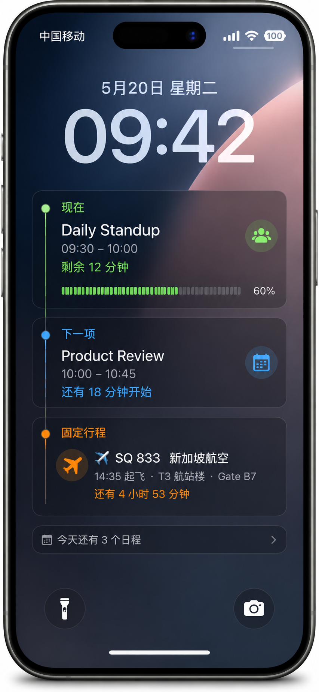

<p align="center">
<a href="https://github.com/wentevill/Pecker"></a>
</p>

<p align="center">
<b>A smart timeline app for capturing and organizing your important moments</b>
</p>

<p align=center>
<a href="https://github.com/wentevill/Pecker/blob/main/LICENSE"></a>
<a href="https://github.com/wentevill/Pecker"></a>
<a href="https://github.com/wentevill/Pecker/releases"></a>
</p>

---

## English

### What is Pecker

[English](#english) | [中文](#中文)

Pecker is a native iOS application designed to help you manage and organize your timeline of important events and activities. The app features a beautiful dark theme interface and leverages Apple's latest technologies including Live Activities and Dynamic Island support to keep you informed about your current priorities.

With Pecker, you can:
- Create and manage a personalized timeline of events
- Get real-time notifications about your most important current item
- Experience a polished UI with Live Activity integration
- Organize your schedule with an intuitive interface

### Features

- **Timeline Management** - Create and organize events on an interactive timeline
- **Live Activities** - Real-time updates on your Lock Screen and Dynamic Island
- **Dark Theme UI** - Beautiful, modern interface with a dark color scheme
- **Smart Notifications** - Stay informed about your current priorities
- **Seamless Integration** - Native iOS 16+ support with latest Apple frameworks

### Screenshots

<table>
  <tr>
      <td width="50%" align="center"><b>Now Timeline</b></td>
      <td width="50%" align="center"><b>Dark Theme Design</b></td>
  </tr>
  <tr>
     <td></td>
     <td></td>
  </tr>
</table>

### System Requirements

- **iOS** 16.0+
- **Swift** 5.0+
- **Xcode** 14.0+

### Installation

#### From Source

```bash
git clone https://github.com/wentevill/Pecker.git
cd Pecker
open Pecker.xcodeproj
```

Build and run the project in Xcode on your target iOS device or simulator.

### Architecture

Pecker is built with a modular architecture:

- **Pecker** - Main app target
- **PeckerLiveActivity** - Live Activity and Dynamic Island support
- **Shared** - Shared utilities and models across targets
- **PeckerTests** - Unit and integration tests

### Development

The project uses Swift Package Manager and Xcode project configuration. See `project.yml` for build settings and `Package.swift` for dependencies.

### License

This project is licensed under the MIT License - see the [LICENSE](LICENSE) file for details.

---

## 中文

### Pecker 是什么

Pecker 是一个原生 iOS 应用，旨在帮助您管理和组织您的重要事件和活动的时间线。该应用采用精美的深色主题界面，并充分利用 Apple 最新技术，包括 Live Activities 和 Dynamic Island 支持，让您始终了解当前的优先事项。

使用 Pecker，您可以：
- 创建和管理个性化的事件时间线
- 获取有关您当前最重要项目的实时通知
- 体验带有 Live Activity 集成的精美 UI
- 使用直观的界面组织您的日程

### 主要功能

- **时间线管理** - 在交互式时间线上创建和组织事件
- **Live Activities** - Lock Screen 和 Dynamic Island 上的实时更新
- **深色主题 UI** - 美观、现代的深色主题界面
- **智能通知** - 随时了解您的当前优先事项
- **无缝集成** - 原生 iOS 16+ 支持，集成最新 Apple 框架

### 截图

<table>
  <tr>
      <td width="50%" align="center"><b>Now 时间线</b></td>
      <td width="50%" align="center"><b>深色主题设计</b></td>
  </tr>
  <tr>
     <td></td>
     <td></td>
  </tr>
</table>

### 系统要求

- **iOS** 16.0+
- **Swift** 5.0+
- **Xcode** 14.0+

### 安装

#### 从源代码安装

```bash
git clone https://github.com/wentevill/Pecker.git
cd Pecker
open Pecker.xcodeproj
```

在 Xcode 中构建项目并在目标 iOS 设备或模拟器上运行。

### 架构

Pecker 采用模块化架构设计：

- **Pecker** - 主应用 Target
- **PeckerLiveActivity** - Live Activity 和 Dynamic Island 支持
- **Shared** - 跨 Target 共享的工具函数和数据模型
- **PeckerTests** - 单元测试和集成测试

### 开发

该项目使用 Swift Package Manager 和 Xcode 项目配置。详见 `project.yml` 中的编译设置和 `Package.swift` 中的依赖配置。

### 许可证

本项目采用 MIT 许可证 - 详见 [LICENSE](LICENSE) 文件。

---

<p align="center">
<br/><br/>
Made with ❤️ by <a href="https://github.com/wentevill">wentevill</a>
<br/><br/>
</p>
