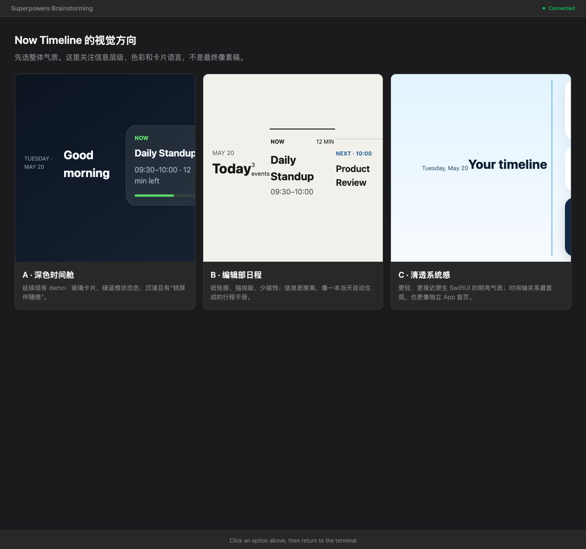
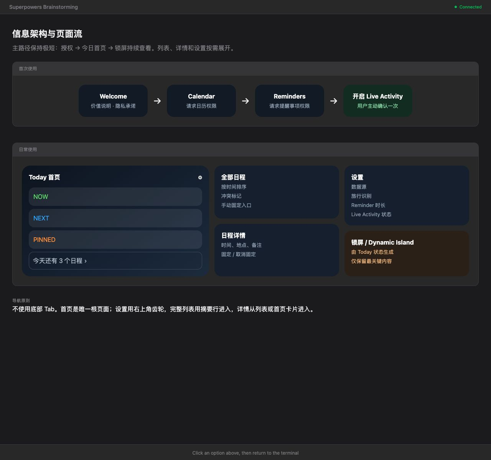
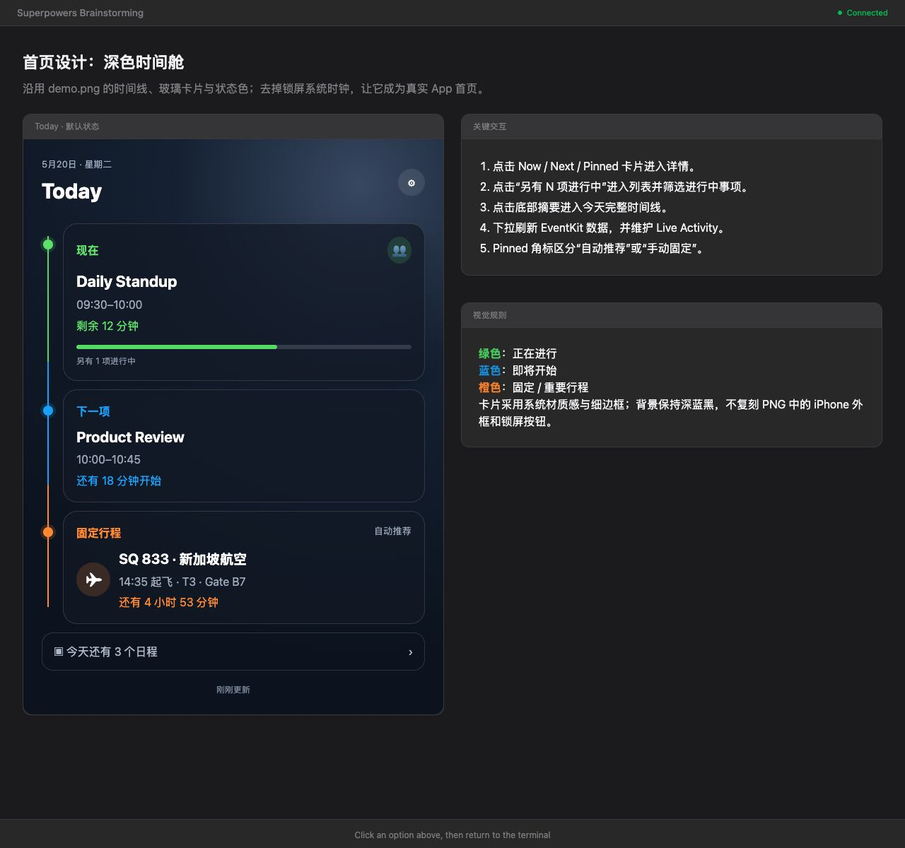
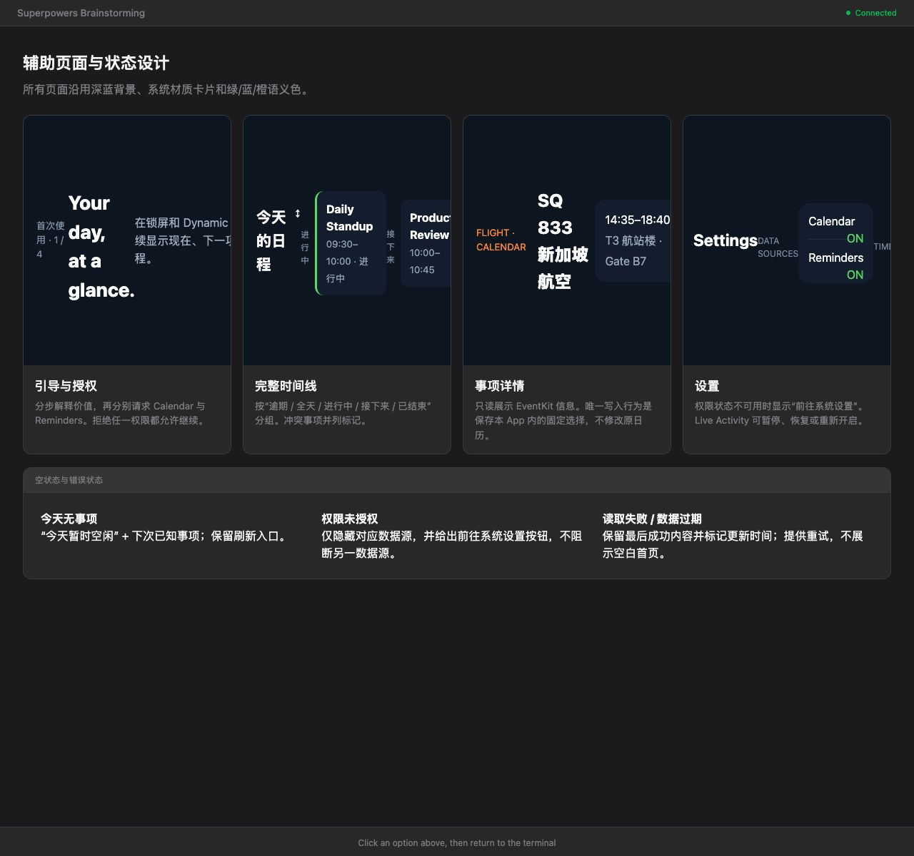
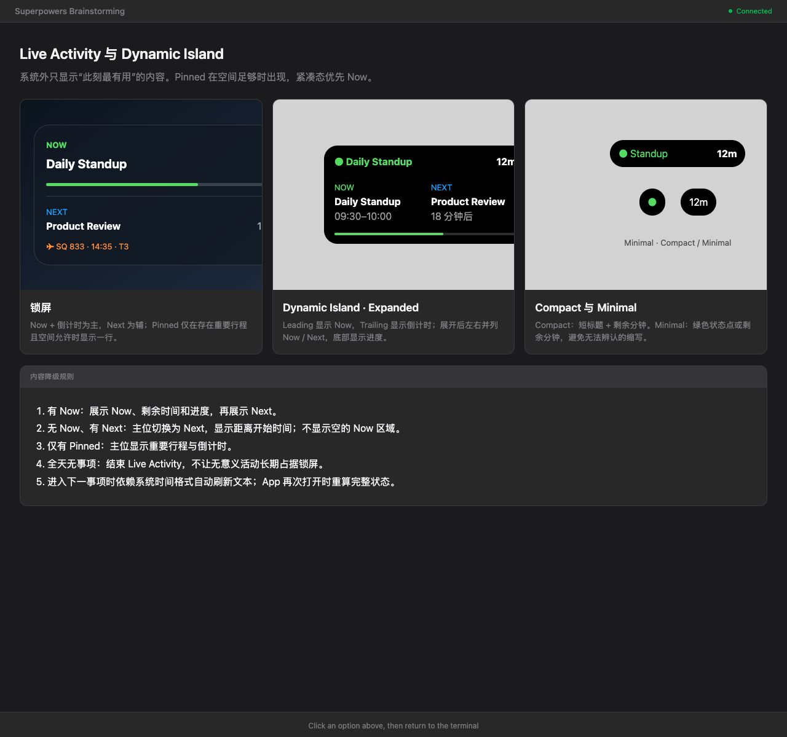
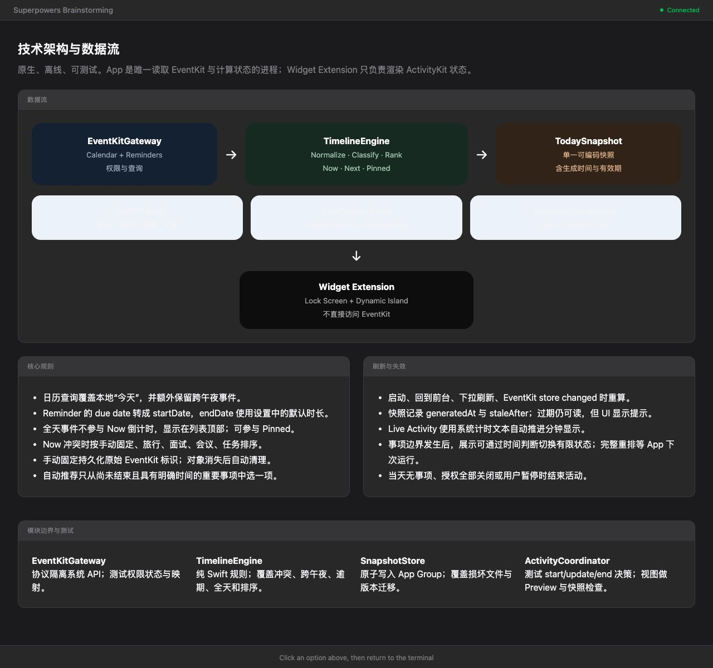

# Now Timeline Visual Design

Date: 2026-06-22

These previews preserve the visual design reviewed during product
brainstorming. The approved direction is **A · 深色时间舱**, with `demo.png` as
the primary visual reference.

The behavioral and technical requirements live in
[`../superpowers/specs/2026-06-22-now-timeline-design.md`](../superpowers/specs/2026-06-22-now-timeline-design.md).

## 1. Visual direction

Option A is the approved direction. Options B and C are retained as design
history.

## 2. Information architecture

## 3. Today screen

This is the approved app-home interpretation of the original Lock Screen
concept.

## 4. Supporting screens and states

Includes onboarding, permissions, full timeline, item detail, settings, empty
states, and error states.

## 5. Live Activity and Dynamic Island

## 6. Technical architecture

